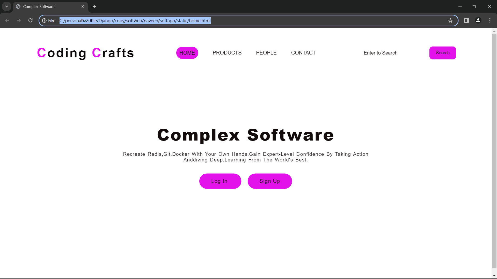
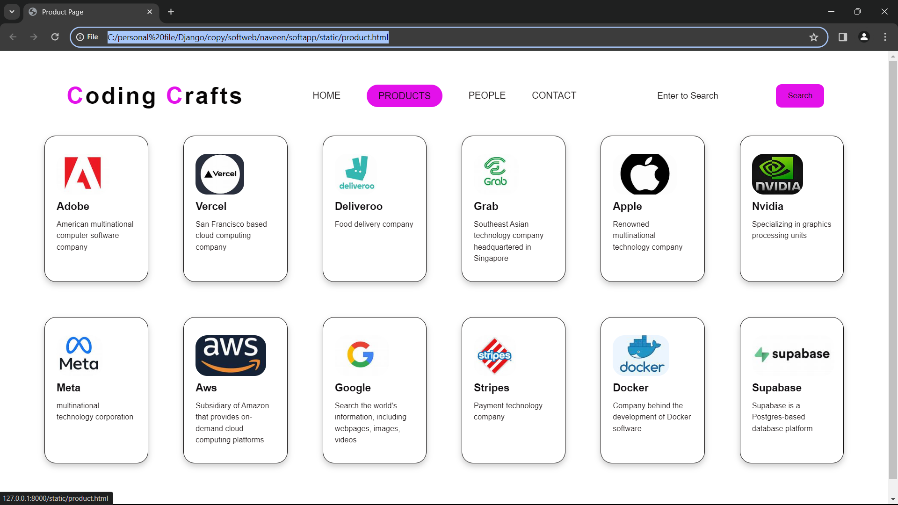
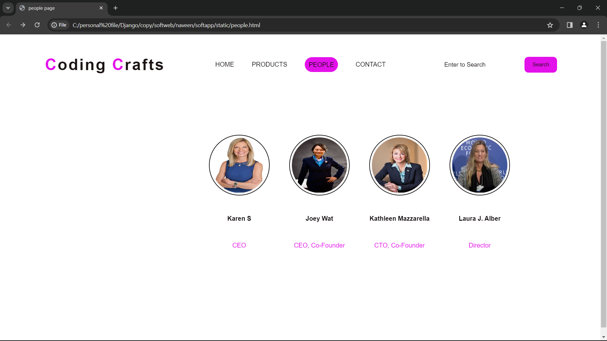
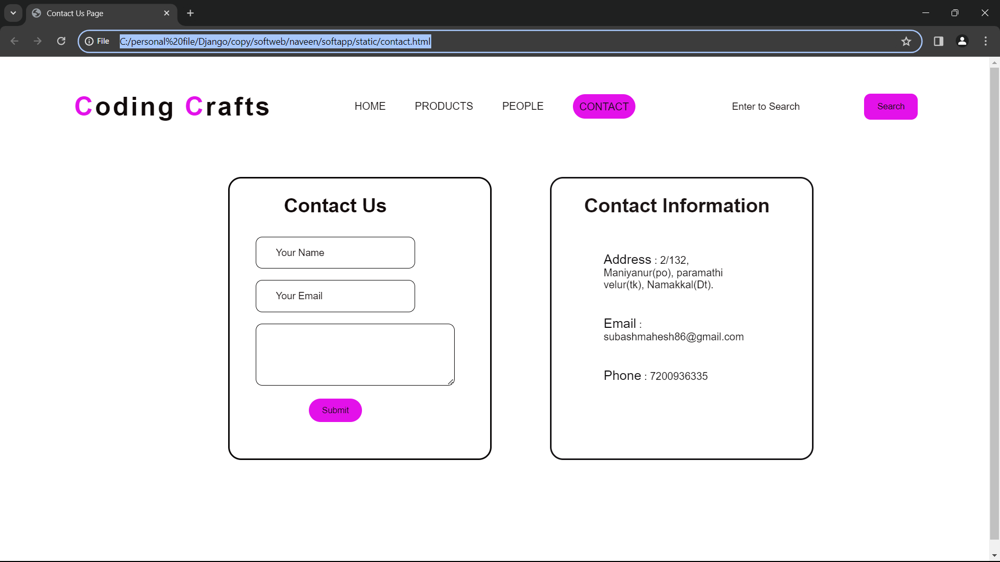

# Ex.07 Software Product Company Website
## Date:

## AIM:
To develop a static company website to display the softwares and services provided by the company.

## DESIGN STEPS:

### Step 1:
Requirement collection.

### Step 2:
Creating the layout using HTML and CSS.

### Step 3:
Updating the sample content.

### Step 4:
Choose the appropriate style and color scheme.

### Step 5:
Validate the layout in various browsers.

### Step 6:
Validate the HTML code.

### Step 7:
Publish the website in the given URL.

## PROGRAM:

```
home .html 


<html>
    <head>
        <meta name="viewport" content="width=device-width, initial-scale=1.0">
        <title> Complex Software</title>
        <style type="text/css">
            * {
                margin: 0;
                padding: 0;
                font-family: Arial, Helvetica, sans-serif;
            }
            .banner {
                width: 100%;
                height: 100vh;
                background-image: linear-gradient(rgba(196, 31, 31,rgba(162, 33, 33, 0.75)0,0.75)),url(background.jpg);
                background-size: cover;
                background-position: center;
            }
            .navbar {
                width: 85%;
                margin: auto;
                padding: 35px 0;
                display: flex;
                align-items: center;
                justify-content: space-between;
            }
            .logo {
                color: #e311ea;
                font-size: 40px;
                font-weight: 700;
                letter-spacing: 3px;
            }
            span {
                color: rgb(11, 9, 9);
            }
            form {
                width: 300px;
                height: 40px;
                display: flex;
                background: rgba(255, 255, 255, 0.2);
                padding: 1px 1px;
                font-size: 15px;
                border-radius: 10px;
                backdrop-filter: blur(4px) saturate(180%);
            }
            form input {
                background: transparent;
                flex: 1;
                border: 0;
                outline: none;
                padding: 12px 20px;
                font-size: 15px;
                color: rgb(17, 13, 13);
            } 
            ::placeholder {
                color: rgb(24, 18, 18);
            }
            form button {
                border: 0;
                outline: none;
                padding: 5px 20px;
                color: rgb(16, 11, 11);
                border-radius: 10px;
                background: #e311ea;
                cursor: pointer;
            }
            .navbar li {
                list-style: none;
                display: inline-block;
                margin: 0 20px;
                position: relative;
            }
            .navbar li a {
                text-decoration: none;
                color: rgb(15, 10, 10);
                text-transform: uppercase;
            }
            .navbar li:hover {
                border: 1px;
                padding: 10px;
                color: rgb(15, 12, 12);
                background-color: #e311ea;
                transition: 0.5s; 
                cursor: pointer;
                border-radius: 30px;
            }
            .content {
                position: absolute;
                top: 50%;
                left: 50%;
                transform: translate(-50%,-50%);
                text-align: center;
            }
            .text h2 {
                color: rgb(19, 13, 13);
                font-weight: 800;
                font-size: 50px;
                letter-spacing: 3px;
            }
            .text p {
                color: rgb(23, 17, 17);
                text-transform: capitalize;
                font-size: 15px;
                margin-bottom: 30px;
                word-spacing: 2px;
                letter-spacing: 1px;
            }
            .login {
                margin: 0px 10px;
                border: 2px solid #e311ea;
                padding: 13px 35px;
                letter-spacing: 1px;
                color: rgb(20, 13, 13);
                border-radius: 30px;
                background-color: #e311ea;
                text-decoration: none;
            }
            .login:hover {
                border: 2px solid #e311ea;
                color: #e311ea;
                background-color: rgb(17, 14, 14);
                transition: 0.5s;
                cursor: pointer;
            } 
            .signup {
                margin: 0px 10px;
                border: 2px solid #e311ea;
                padding: 13px 35px;
                letter-spacing: 1px;
                color: rgb(16, 11, 11);
                border-radius: 30px;
                background-color: #e311ea;
                text-decoration: none;
            }
            .signup:hover {
                border: 2px solid #e311ea;
                color: #6fa1f8;
                background-color: rgb(18, 14, 14);
                transition: 0.5s;
                cursor: pointer;
            }
            footer {
                background-color: #e311ea;
                margin-top: auto;
            }
            .bg-product {
                border: 1px;
                padding: 10px;
                color: rgb(17, 16, 16);
                background-color:#e311ea ;
                border-radius: 30px;
            } 
        </style>
    </head>
<body>
    <div class="banner">
        <br>
        <div class="navbar">
            <h1 class="logo">C<span>oding </span>C<span>rafts</span></h1>
            <ul>
                <li><a href="http://127.0.0.1:8000/static/home.html" class="bg-product"> Home </a></li>
                <li><a href="http://127.0.0.1:8000/static/product.html"> Products </a></li>
                <li><a href="http://127.0.0.1:8000/static/people.html"> People </a></li>
                <li><a href="http://127.0.0.1:8000/static/contact.html"> Contact </a></li>
            </ul>
            <form action="" method="get">
                <input type="text" placeholder="Enter to Search">
                <button type="submit"> Search </button>
            </form>
        </div>
        <div class="content">
            <div class="text">
                <h2> Complex Software </h2>
                <br>
                <p> Recreate Redis,Git,Docker with your own hands.Gain expert-level confidence by taking action anddiving deep,learning from the world's best. </p>
                <br>
                <div>
                    <a href="#" class="login"> Log In </a>
                    <a href="#" class="signup"> Sign Up </a>
                </div>
            </div>
        </div>  
    </div>
    <footer>
        <center> Designed and Developed by Subash M (23014070) </center>
    </footer>
</body>
</html>

product.html

<html>
    <head>
        <meta name="viewport" content="width=device-width, initial-scale=1.0">
        <title> Product Page </title>
        <style type="text/css">
            * {
                margin: 0;
                padding: 0;
                font-family: Arial, Helvetica, sans-serif;
            }
            .banner {
                width: 100%;
                height: 100vh;
                background-image: linear-gradient(rgba(163, 21, 21,rgba(185, 32, 32, 0.75)0,0.75)),url(background.jpg);
                background-size: cover;
                background-position: center;
            }
            .navbar {
                width: 85%;
                margin: auto;
                padding: 35px 0;
                display: flex;
                align-items: center;
                justify-content: space-between;
            }
            .bg-product {
                border: 1px;
                padding: 10px;
                color: rgb(17, 16, 16);
                background-color:#e311ea;
                border-radius: 30px;
            }
            .logo {
                color: #e311ea;
                font-size: 40px;
                font-weight: 700;
                letter-spacing: 3px;
            }
            span {
                color: rgb(7, 5, 5);
            }
            form {
                width: 300px;
                height: 40px;
                display: flex;
                background: rgba(255, 255, 255, 0.2);
                padding: 1px 1px;
                font-size: 15px;
                border-radius: 10px;
                backdrop-filter: blur(4px) saturate(180%);
            }
            form input {
                background: transparent;
                flex: 1;
                border: 0;
                outline: none;
                padding: 12px 20px;
                font-size: 15px;
                color: rgb(19, 17, 17);
            } 
            ::placeholder {
                color: rgb(17, 14, 14);
            }
            form button {
                border: 0;
                outline: none;
                padding: 5px 20px;
                color: rgb(21, 18, 18);
                border-radius: 10px;
                background: #e311ea;
                cursor: pointer;
            }
            .navbar li {
                list-style: none;
                display: inline-block;
                margin: 0 20px;
                position: relative;
            }
            .navbar li a {
                text-decoration: none;
                color: rgb(16, 12, 12);
                text-transform: uppercase;
            }
            .navbar li:hover {
                border: 1px;
                padding: 10px;
                color: rgb(20, 17, 17);
                background-color: #e311ea;
                transition: 0.5s; 
                cursor: pointer;
                border-radius: 30px;
            }
            .container {
                background: transparent;
                padding: 10px 5%;
                padding-bottom: 100px;
            }
            .container .box-container {
                display: grid;
                grid-template-columns: repeat(auto-fit, minmax(170px, 1fr));
                gap: 60px;
            }
            .container .box-container .box {
                color: rgb(12, 10, 10);
                box-shadow: 0 5px 10px rgba(0,0,0,.2);
                border-radius: 20px;
                background: transparent;
                border: 1px solid rgb(15, 13, 13);
                padding: 30px 20px;
            }
            .container .box-container .box img {
                height: 70px;
                border-radius: 20px;
            }
            .container .box-container .box h3 {
                color: #0e0b0e;
                font-size: large;
                padding: 10px 0;
            }
            .container .box-container .box p {
                color: rgb(19, 12, 12);
                font-size: small;
                line-height: 1.5;
            }
            footer {
                background-color: #d00fd0;
                margin-top: auto;
            }
        </style>
    </head>
<body>
    <div class="banner">
        <br>
        <div class="navbar">
            <h1 class="logo">C<span>oding </span>C<span>rafts</span></h1>
            <ul>
                <li><a href="http://127.0.0.1:8000/static/home.html"> Home </a></li>
                <li><a href="http://127.0.0.1:8000/static/product.html" class="bg-product"> Products </a></li>
                <li><a href="http://127.0.0.1:8000/static/people.html"> People </a></li>
                <li><a href="http://127.0.0.1:8000/static/contact.html"> Contact </a></li>
            </ul>
            <form action="" method="get">
                <input type="text" placeholder="Enter to Search">
                <button type="submit"> Search </button>
            </form>
        </div>
        <div class="container">
            <div class="box-container">
                <div class="box">
                    
                    <h3> Adobe </h3>
                    <p> American multinational computer software company </p>
                </div>
                <div class="box">
                    
                    <h3> Vercel </h3>
                    <p> San Francisco based cloud computing company </p>
                </div>
                <div class="box">
                    
                    <h3> Deliveroo </h3>
                    <p> Food delivery company </p>
                </div>
                <div class="box">
                    
                    <h3> Grab </h3>
                    <p> Southeast Asian technology company headquartered in Singapore </p>
                </div>
                <div class="box">
                    
                    <h3> Apple </h3>
                    <p> Renowned multinational technology company </p>
                </div>
                <div class="box">
                    
                    <h3> Nvidia </h3>
                    <p> Specializing in graphics processing units </p>
                </div>
                <div class="box">
                    
                    <h3> Meta </h3>
                    <p>  multinational technology corporation </p>
                </div>
                <div class="box">
                    
                    <h3> Aws </h3>
                    <p> Subsidiary of Amazon that provides on-demand cloud computing platforms </p>
                </div>
                <div class="box">
                    
                    <h3> Google </h3>
                    <p>  Search the world's information, including webpages, images, videos </p>
                </div>
                <div class="box">
                    
                    <h3> Stripes </h3>
                    <p> Payment technology company </p>
                </div>
                <div class="box">
                    
                    <h3> Docker </h3>
                    <p> Company behind the development of Docker software </p>
                </div>
                <div class="box">
                    
                    <h3> Supabase </h3>
                    <p> Supabase is a Postgres-based database platform </p>
                </div>
            </div>
        </div>
    </div>
    <footer>
        <center> Designed and Developed by Subash M (23008968) </center>
    </footer>
</body>
</html>

people.html

<html>
    <head>
        <meta name="viewport" content="width=device-width, initial-scale=1.0">
        <title> people page </title>
        <style type="text/css">
            * {
                margin: 0;
                padding: 0;
                font-family: Arial, Helvetica, sans-serif;
            }
            .banner {
                width: 100%;
                height: 100vh;
                background-image: linear-gradient(rgba(184, 52, 52,rgba(188, 50, 50, 0.75)0,0.75)),url(background.jpg);
                background-size: cover;
                background-position: center;
            }
            .navbar {
                width: 85%;
                margin: auto;
                padding: 35px 0;
                display: flex;
                align-items: center;
                justify-content: space-between;
            }
            .bg-people {
                border: 1px;
                padding: 10px;
                color: rgb(19, 13, 13);
                background-color: #e311ea;
                border-radius: 30px;
            }
            .logo {
                color: #e311ea;
                font-size: 40px;
                font-weight: 700;
                letter-spacing: 3px;
            }
            span {
                color: rgb(27, 19, 19);
            }
            form {
                width: 300px;
                height: 40px;
                display: flex;
                background: rgba(255, 255, 255, 0.2);
                padding: 1px 1px;
                font-size: 15px;
                border-radius: 10px;
                backdrop-filter: blur(4px) saturate(180%);
            }
            form input {
                background: transparent;
                flex: 1;
                border: 0;
                outline: none;
                padding: 12px 20px;
                font-size: 15px;
                color: rgb(15, 10, 10);
            } 
            ::placeholder {
                color: rgb(19, 13, 13);
            }
            form button {
                border: 0;
                outline: none;
                padding: 5px 20px;
                color: rgb(20, 15, 15);
                border-radius: 10px;
                background: #e311ea;
                cursor: pointer;
            }
            .navbar li {
                list-style: none;
                display: inline-block;
                margin: 0 20px;
                position: relative;
            }
            .navbar li a {
                text-decoration: none;
                color: rgb(19, 12, 12);
                text-transform: uppercase;
            }
            .navbar li:hover {
                border: 1px;
                padding: 10px;
                color: rgb(15, 9, 9);
                background-color: #e311ea;
                transition: 0.5s; 
                cursor: pointer;
                border-radius: 30px;
            }
            .image {
                position: relative;
                border: 0;
                top: 70px;
                background: transparent;
            }
            .image table {
                border: 0;
                color: rgb(16, 11, 11);
                position: relative;
                left: 150px;
            }
            .image table img {
                height: 140px;
                width: 140px;
                border: 2px solid rgb(17, 14, 14);
                padding: 5px;
                border-radius: 50%;
            }
            .image table td {
                color: #e311ea;
            }
            footer {
                background-color: #e311ea;
                margin-top: auto;
            }
        </style>
    </head>
<body>
    <center>
        <div class="banner">
            <br>
            <div class="navbar">
                <h1 class="logo">C<span>oding </span>C<span>rafts</span></h1>
                <ul>
                    <li><a href="http://127.0.0.1:8000/static/home.html"> Home </a></li>
                    <li><a href="http://127.0.0.1:8000/static/product.html"> Products </a></li>
                    <li><a href="http://127.0.0.1:8000/static/people.html" class="bg-people"> People </a></li>
                    <li><a href="http://127.0.0.1:8000/static/contact.html"> Contact </a></li>
                </ul>
                <form action="" method="get">
                    <input type="text" placeholder="Enter to Search">
                    <button type="submit"> Search </button>
                </form>
            </div>
            <div class="image">
                <table cellspacing="50"> 
                    <tr align="center">
                        <td>  </td>
                        <td>  </td>
                        <td>  </td>
                        <td>  </td>
                    </tr>
                    <tr align="center">
                        <th> Karen S </th>
                        <th> Joey Wat </th>
                        <th> Kathleen Mazzarella </th>
                        <th> Laura J. Alber </th>
                    </tr>
                    <tr align="center">
                        <td> CEO </td>
                        <td> CEO, Co-Founder </td>
                        <td> CTO, Co-Founder </td>
                        <td> Director </td>
                    </tr>
                </table>
            </div>
        </div>
    </center>
    <footer>
        <center> Designed and Developed by Subash M (23014070) </center>
    </footer>
</body>
</html>

contact .html

<html>
    <head>
        <meta name="viewport" content="width=device-width, initial-scale=1.0">
        <title> Contact Us Page </title>
        <style type="text/css">
            * {
                margin: 0;
                padding: 0;
                font-family: Arial, Helvetica, sans-serif;
            }
            .banner {
                width: 100%;
                height: 100vh;
                background-image: linear-gradient(rgba(202, 40, 40,rgba(190, 56, 56, 0.75)0,0.75)),url(background.jpg);
                background-size: cover;
                background-position: center;
            }
            .navbar {
                width: 85%;
                margin: auto;
                padding: 35px 0;
                display: flex;
                align-items: center;
                justify-content: space-between;
            }
            .bg-contact {
                border: 1px;
                padding: 10px;
                color: rgb(14, 11, 11);
                background-color: #e311ea;
                border-radius: 30px;
            }
            .logo {
                color: #e311ea;
                font-size: 40px;
                font-weight: 700;
                letter-spacing: 3px;
            }
            span {
                color: rgb(17, 11, 11);
            }
            .navbar form {
                width: 300px;
                height: 40px;
                display: flex;
                background: rgba(255, 255, 255, 0.2);
                padding: 1px 1px;
                font-size: 15px;
                border-radius: 10px;
                backdrop-filter: blur(4px) saturate(180%);
            }
            .navbar form input {
                background: transparent;
                flex: 1;
                border: 0;
                outline: none;
                padding: 12px 20px;
                font-size: 15px;
                color: rgb(16, 10, 10);
            } 
            ::placeholder {
                color: rgb(16, 10, 10);
            }
            .navbar form button {
                border: 0;
                outline: none;
                padding: 5px 20px;
                color: rgb(16, 10, 10);
                border-radius: 10px;
                background: #e311ea;
                cursor: pointer;
            }
            .navbar li {
                list-style: none;
                display: inline-block;
                margin: 0 20px;
                position: relative;
            }
            .navbar li a {
                text-decoration: none;
                color: rgb(16, 12, 12);
                text-transform: uppercase;
            }
            .navbar li:hover {
                border: 1px;
                padding: 10px;
                color: rgb(22, 15, 15);
                background-color: #e311ea;
                transition: 0.5s; 
                cursor: pointer;
                border-radius: 30px;
            }
            .box {
                display: flex;
                column-gap: 40px;
                background: transparent;
                position: relative;
                top: 50px;
            }
            .box-1 {
                height: 430px;
                width: 400px;
                border: 3px solid rgb(11, 9, 9);
                border-radius: 20px;
                background: transparent;
                position: relative;
                left: 350px;
            }
            .box-2 {
                height: 430px;
                width: 400px;
                border: 3px solid #151315;
                border-radius: 20px;
                background: transparent;
                position: relative;
                left: 400px;
            }
            .box-1 form {
                display: flex;
                color: rgb(18, 10, 10);
                background: transparent;
                padding: 10px;
                font-size: 15px;
                position: relative;
                top: 15px;
            }
            .box-1 form input {
                background: transparent;
                display: flex;
                border: 1px solid rgb(12, 11, 11);
                border-radius: 10px;
                padding: 15px 30px;
                font-size: 15px;
                color: rgb(21, 15, 15);
                position: relative;
                top: 30px;
            }
            .box-1 form textarea {
                background: transparent;
                color: rgb(21, 13, 13);
                padding: 15px 10px;
                position: relative;
                top: 30px;
                left: 30px;
                border: 1px solid rgb(10, 8, 8);
                border-radius: 10px;
            }
            .box-1 form button {
                border: 0;
                outline: none;
                padding: 10px 20px;
                color: rgb(16, 12, 12);
                border-radius: 30px;
                background: #e311ea;
                cursor: pointer;
                position: relative;
                top: 50px;
            }
            .box-2 h2 {
                color: rgb(27, 20, 20);
                position: relative;
                top: 25px;
                left: 50px;
                font-size: 30px;
            }
            .box-2 p {
                color: rgb(16, 13, 13);
                position: relative;
                top: 50px;
                padding: 10px 80px;
            }
            .box-2 span {
                color: #0a080a;
                font-size: 20px;
            }
            footer {
                background-color: #030303;
                margin-top: auto;
            }
        </style>
    </head>
<body>
    <div class="banner">
        <br>
        <div class="navbar">
            <h1 class="logo">C<span>oding </span>C<span>rafts</span></h1>
            <ul>
                <li><a href="http://127.0.0.1:8000/static/home.html"> Home </a></li>
                <li><a href="http://127.0.0.1:8000/static/product.html"> Products </a></li>
                <li><a href="http://127.0.0.1:8000/static/people.html"> People </a></li>
                <li><a href="http://127.0.0.1:8000/static/contact.html" class="bg-contact"> Contact </a></li>
            </ul>
            <form action="" method="get">
                <input type="text" placeholder="Enter to Search">
                <button type="submit"> Search </button>
            </form>
        </div>
        <div class="box">
            <div class="box-1">
                <form>
                    <center>
                        <h1> Contact Us </h1>
                        <input type="text" placeholder="Your Name">
                        <br>
                        <input type="email" placeholder="Your Email">
                        <br>
                        <textarea rows="4" cols="40" placeholder="Your Message"> </textarea>
                        <br>
                        <button type="submit"> Submit </button>
                    </center>
                </form>
            </div>
            <div class="box-2"> 
                <h2> Contact Information </h2>
                <br>
                <p> <span>Address</span> : 2/132, Maniyanur(po), paramathi velur(tk), Namakkal(Dt). </p>
                <br>
                <p> <span>Email</span> : subashmahesh86@gmail.com </p>
                <br>
                <p> <span>Phone</span> : 7200936335 </p>
                <br>
            </div>
        </div>
    </div>
    <footer>
        <center> Designed and Developed by Subash M (23014070) </center>
    </footer>
</body>
</html>

```

## OUTPUT:






## RESULT:
The program for designing software company website using HTML and CSS is completed successfully.
